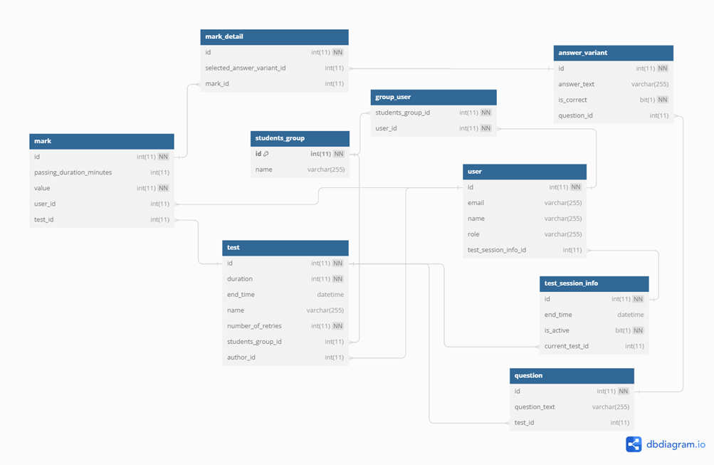
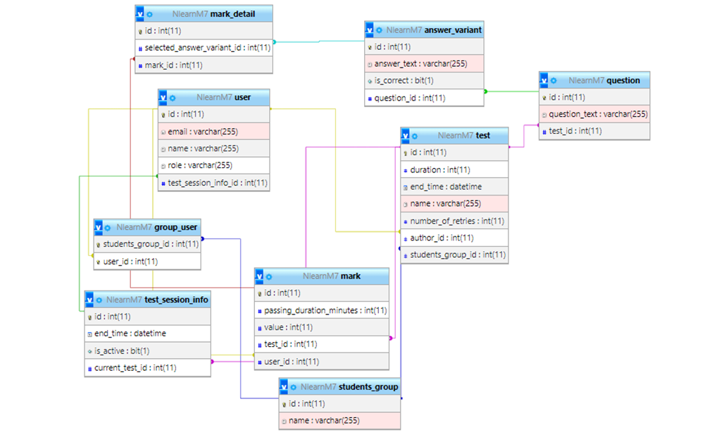

## Романів Юрій ІПЗ-23

### Тема
Тестування знань
### Середовище
- MySql

## приклад використання у вебсайтом
[https://github.com/Yurii-Romaniv/Nlearn](https://github.com/Yurii-Romaniv/Nlearn)

## Діаграма

#### діаграма

#### знімок діаграми (з phpMyAdmin)

## Експорт бази (повністю згенеровано [моїм java застосунком](https://github.com/Yurii-Romaniv/Nlearn))
[NlearnM4.sql](NlearnM4.sql)

## Примітка
привязку тесту до групи(`students_group`) я таки залишив, натомість зробивши відношення між групами і користувачами ManyToMany. На мою думку, завдяки цьому використання бд у вебпроекті сильно спрощується, а також економиться память. Ефективніше створити кілька додаткових груп навіть для нестандартних ситуацій чим при створенні кожного тесту зберігати список усіх користувачів які його проходитимуть 